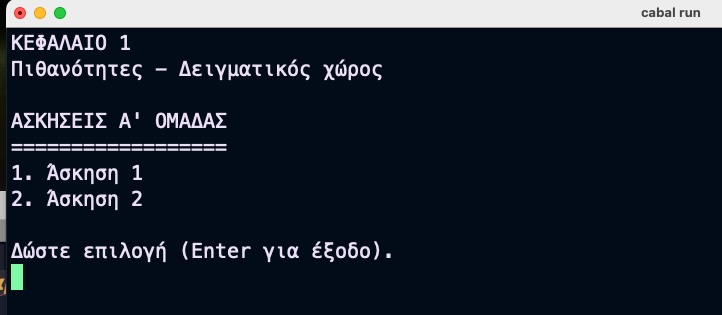
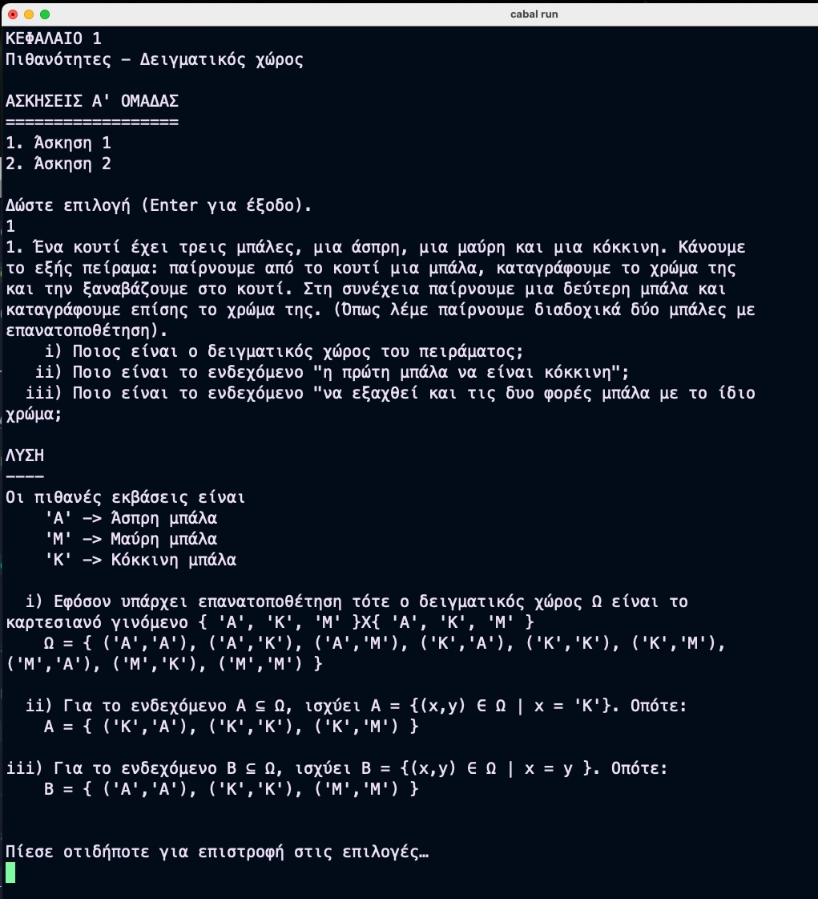

# _Θεωρία και Εφαρμογές των Μαθηματικών Λυκείου σε Haskell_

Η θεωρία και κυρίως οι ασκήσεις από τα βιβλία μαθηματικών του Λυκείου σε Haskell.

## Σκοπός

H εκπαίδευση μου στα μαθηματικά και στην [Haskell](https://www.haskell.org/).

### Βιβλία που διδάσκομαι*

1. ΑΛΓΕΒΡΑ ΚΑΙ ΣΤΟΙΧΕΙΑ ΠΙΘΑΝΟΤΗΤΩΝ Α´ τάξης Γενικού Λυκείο [σύνδεσμος](https://ebooks.edu.gr/ebooks/d/8547/2466/22-0284-01_Algebra-kai-Stoicheia-Pithanotiton_A-Lykeiou_Vivlio-Mathiti.pdf)
    > **Συγγραφείς:** Ανδρεαδάκης Στυλιανός - Κατσαργύρης Βασίλειος -
    Παπασταυρίδης Σταύρος - Πολύζος Γεώργιος - Σβέρκος Ανδρέας  
    > **Εκδόσεις:** ΙΤΥΕ «ΔΙΟΦΑΝΤΟΣ»

*_όσο τα ολοκληρώνω θα τα προσθέτω_

### Παρουσίαση ασκήσεων

Σε κάθε έτος/βιβλίο θα υπάρχει και αντίστοιχος κατάλογος (folder) με τις ασκήσεις.
Είναι ένα cabal project εκτελέσιμου αρχείου.

#### Οδηγίες δημιουργίας - εκτέλεσης - ελέγχου

Το εκτελέσιμο δημιουργείται με την εντολή: ```cabal build```

Το εκτελέσιμο αρχείο εκτελείται με: ```cabal run```

Τα όποια τεστ υπάρχουνε, ΑΝ υπάρχουν, εκτελούνται με: ```cabal test```

#### Παράδειγμα

1. Επιλέγουμε την άσκηση από το μενού 

2. H άσκηση επιλύεται 

3. Πατώντας οποιοδήποτε πλήκτρο, επιστρέφουμε στο μενού επιλογών.
Με enter στο μενού επιλογών (ή με 0) τερματίζεται το πρόγραμμα.

### Εγγραφή ασκήσεων

Αν επιθυμείτε να γράψετε τις δικές σας απαντήσεις σε ασκήσεις,
το πλαίσιο (template) που έχω είναι το εξής:

1. ΕΚΦΩΝΗΣΗ

    Με την ```prepareText``` ετοιμάζουμε την εκφώνηση της άσκησης.

2. ΔΕΔΟΜΕΝΑ

    Όλα τα δεδομένα και τις απαντήσεις που υπολογίζουμε σαν μεταβλητές.

3. ΛΥΣΗ

    Με την ```prepareText``` και τις μεταβλητές από τα ΔΕΔΟΜΕΝΑ,
    παρουσιάζουμε την απάντηση.

4. Η επιστροφή στο ΜΕΝΟΥ ΕΠΙΛΟΓΩΝ γίνεται με

```haskell
putStrLn "\n\nΠίεσε οτιδήποτε για επιστροφή στις επιλογές…"
_ <- getLine 
main
